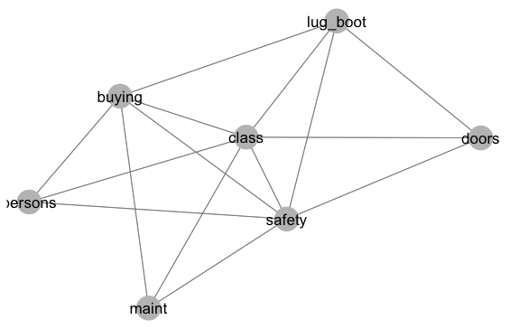

# Summary
The R [@R] package `tcherry` contains a variety of functions for learning the structure of a k'th order t-cherry tree from given data, see for instance @EKTShyp for an explanation of this concept. This is a type of graphical models extending what is known as Chow-Liu trees [@ChowLiu]. The functions attempt to find a t-cherry structure of maximal likelihood. To do this exact, it is necesarry to investigate all possible t-cherry structures of the given order. This is in most cases to time-consuming and therefore most of the functions use greedy search algorithms. Some implementations are inspired by algorithms in @EKTS, @EKTSdisc and @proulx, but the package also contains some new algorithms and extensions. The package is only for structure learning and only categorical data is supported. The learned structure may be used to investigate dependencies between the variables in data. If the structure is used in combination with packages such as `gRain` [@gRain], it may also be used to estimate probability distributions of the variables or for prediction.  

The R package `tcherry` is available on [GitHub](https://github.com/nvihrs14/tcherry).

 
